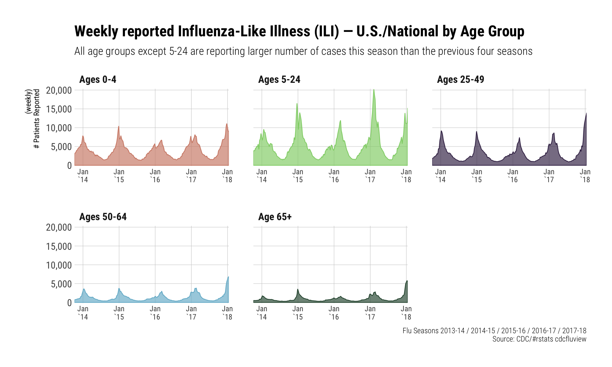
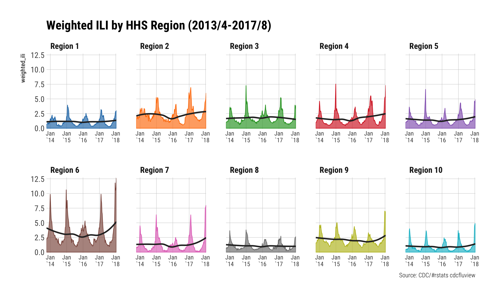
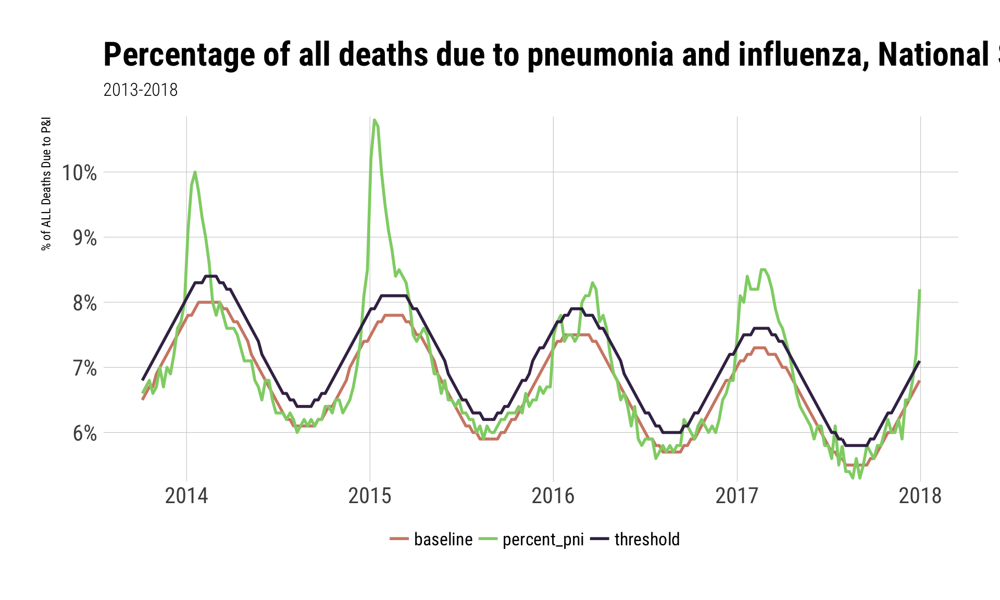

```r
# This is a plain R script you can use as-is, but it's also "spinnable".
# If you use RStudio, go and try to knit it. It will work just like Rmds.
```


```r
# for stat_xspline
library(ggalt) # devtools::install_github("hrbrmstr/statebins")

# for animation
library(magick)

# why you came!
library(cdcfluview)

# package that uses themes you saw in the presentation
library(hrbrthemes)

# makes those block state choropleth-y cartograms
library(statebins)

# all the goodness from Hadley, RStudio, et al
library(tidyverse)
```

## ILI Basic examples


```r
ili <- ilinet("national", years = 2013:2018)

glimpse(ili)
```

```
## Observations: 224
## Variables: 16
## $ region_type      <chr> "National", "National", "National", "National...
## $ region           <chr> "National", "National", "National", "National...
## $ year             <int> 2013, 2013, 2013, 2013, 2013, 2013, 2013, 201...
## $ week             <int> 40, 41, 42, 43, 44, 45, 46, 47, 48, 49, 50, 5...
## $ weighted_ili     <dbl> 1.15746, 1.27184, 1.31623, 1.37444, 1.46781, ...
## $ unweighted_ili   <dbl> 1.13249, 1.21121, 1.25682, 1.37097, 1.42956, ...
## $ age_0_4          <dbl> 2974, 3276, 3483, 3930, 4045, 4434, 4643, 483...
## $ age_25_49        <dbl> 1840, 1924, 2010, 2292, 2354, 2511, 2716, 308...
## $ age_25_64        <dbl> NA, NA, NA, NA, NA, NA, NA, NA, NA, NA, NA, N...
## $ age_5_24         <dbl> 3769, 3925, 3880, 4484, 4642, 5062, 5000, 557...
## $ age_50_64        <dbl> 638, 762, 785, 816, 930, 953, 990, 1083, 1059...
## $ age_65           <dbl> 456, 533, 500, 514, 531, 538, 578, 583, 639, ...
## $ ilitotal         <dbl> 9677, 10420, 10658, 12036, 12502, 13498, 1392...
## $ num_of_providers <dbl> 1960, 1990, 2018, 2027, 2028, 2017, 2054, 201...
## $ total_patients   <dbl> 854487, 860298, 848016, 877917, 874537, 87884...
## $ week_start       <date> 2013-10-07, 2013-10-14, 2013-10-21, 2013-10-...
```

```r
hhs <- ilinet("hhs", years = 2013:2018)

glimpse(hhs)
```

```
## Observations: 2,240
## Variables: 16
## $ region_type      <chr> "HHS Regions", "HHS Regions", "HHS Regions", ...
## $ region           <fctr> Region 1, Region 2, Region 3, Region 4, Regi...
## $ year             <int> 2013, 2013, 2013, 2013, 2013, 2013, 2013, 201...
## $ week             <int> 40, 40, 40, 40, 40, 40, 40, 40, 40, 40, 41, 4...
## $ weighted_ili     <dbl> 0.621395, 1.607510, 0.926323, 0.943459, 0.885...
## $ unweighted_ili   <dbl> 0.615189, 1.431470, 1.094000, 1.020040, 1.139...
## $ age_0_4          <dbl> 117, 632, 401, 432, 402, 585, 48, 111, 234, 1...
## $ age_25_49        <dbl> 44, 321, 293, 249, 207, 418, 39, 74, 178, 17,...
## $ age_25_64        <dbl> NA, NA, NA, NA, NA, NA, NA, NA, NA, NA, NA, N...
## $ age_5_24         <dbl> 168, 644, 465, 666, 435, 709, 71, 178, 399, 3...
## $ age_50_64        <dbl> 19, 120, 75, 62, 110, 120, 17, 28, 79, 8, 15,...
## $ age_65           <dbl> 20, 75, 55, 44, 76, 78, 7, 17, 82, 2, 16, 68,...
## $ ilitotal         <dbl> 368, 1792, 1289, 1453, 1230, 1910, 182, 408, ...
## $ num_of_providers <dbl> 176, 222, 233, 322, 270, 235, 90, 119, 246, 4...
## $ total_patients   <dbl> 59819, 125186, 117824, 142445, 107977, 91046,...
## $ week_start       <date> 2013-10-07, 2013-10-07, 2013-10-07, 2013-10-...
```

```r
update_geom_font_defaults(font_rc)
theme_set(theme_ipsum_rc(grid="XY", strip_text_face = "bold"))
```

```r
select(ili, week_start, starts_with("age")) %>%
  select(-age_25_64) %>%
  gather(group, ct, -week_start) %>%
  mutate(group = factor(group, levels=c("age_0_4", "age_5_24", "age_25_49", "age_50_64", "age_65"),
                        labels=c("Ages 0-4", "Ages 5-24", "Ages 25-49", "Ages 50-64", "Age 65+"))) %>%
  ggplot(aes(week_start, ct, group=group)) +
  stat_xspline(geom="area", aes(color=group, fill=group), size=2/5, alpha=2/3) +
  scale_x_date(expand=c(0,0), date_labels="%b\n`%y") +
  scale_y_comma() +
  scale_color_ipsum() +
  scale_fill_ipsum() +
  labs(x=NULL, y="(weekly)\n# Patients Reported",
       title="Weekly reported Influenza-Like Illness (ILI) — U.S./National by Age Group",
       subtitle="All age groups except 5-24 are reporting larger number of cases this season than the previous four seasons",
       caption="Flu Seasons 2013-14 / 2014-15 / 2015-16 / 2016-17 / 2017-18\nSource: CDC/#rstats cdcfluview"
  ) +
  facet_wrap(~group, scales="free_x", nrow=2) +
  theme(axis.text.x=element_text(size=9)) +
  theme(legend.position="none")
```



```r
ggplot(hhs, aes(week_start, weighted_ili, group=region)) +
  stat_xspline(geom="area", aes(color=region, fill=region), size=2/5, alpha=2/3) +
  geom_smooth(se=FALSE, size=1, color="#2b2b2b") +
  scale_x_date(expand=c(0,0), date_labels="%b\n`%y") +
  scale_y_comma() +
  ggthemes::scale_color_tableau() +
  ggthemes::scale_fill_tableau() +
  labs(x=NULL, title="Weighted ILI by HHS Region (2013/4-2017/8)", caption="Source: CDC/#rstats cdcfluview") +
  facet_wrap(~region, scales="free_x", nrow=2) +
  theme(axis.text.x=element_text(size=9)) +
  theme(legend.position="none")
```



## The "statebins" examples


```r
flu <- ili_weekly_activity_indicators(2017)

filter(flu, weekend == last(weekend)) %>%
  statebins(state_col = "statename", value_col = "activity_level", round = TRUE,
            ggplot2_scale_function = viridis::scale_fill_viridis,
            name = "ILI Activity Level  ") +
  labs(title=sprintf("U.S. ILI Weekly Activity : Week Ending %s / 2017-18 Season", last(flu$weekend))) +
  theme_statebins(base_family="Roboto Condensed")
```


## Mortality example


```r
mort <- pi_mortality(years=2013:2018)

select(mort, wk_end, baseline, threshold, percent_pni) %>%
  gather(measure, value, -wk_end) %>%
  arrange(wk_end) %>%
  ggplot(aes(wk_end, value, group=measure)) +
  geom_line(aes(color=measure), size=1) +
  labs(
    x=NULL, y="% of ALL Deaths Due to P&I",
    title="Percentage of all deaths due to pneumonia and influenza, National Summary",
    subtitle="2013-2018"
  ) +
  theme_ipsum_rc(grid="XY", base_size=16, plot_title_size=24) +
  scale_color_ipsum(name=NULL) +
  scale_y_percent() +
  theme(legend.position="bottom") +
  theme(legend.direction="horizontal")
```



## Animation

The following makes the animation, but can take a bit, so it's off by default.


```r
flu <- ili_weekly_activity_indicators(2017)

frames <- image_graph(width=1800, height=1200, res=144)

arrange(flu, weekend) %>%
  pull(weekend) %>%
  unique() %>%
  map(~{
    filter(flu, weekend == .x) %>%
      statebins(state_col = "statename", value_col = "activity_level", round = TRUE,
                ggplot2_scale_function = viridis::scale_fill_viridis, limits=c(0,10),
                name = "ILI Activity Level  ") +
      labs(title=sprintf("U.S. ILI Weekly Activity : Week Ending %s / 2017-18", .x)) +
      theme_statebins(base_family="Roboto Condensed") -> gg
    print(gg)
  }) -> y

gif <- image_animate(frames, 1)
image_write(gif, "fluview.gif")
```


---
title: "2018-01-24-isds.R"
author: "hrbrmstr"
date: "Tue Jan 23 20:34:40 2018"
---
